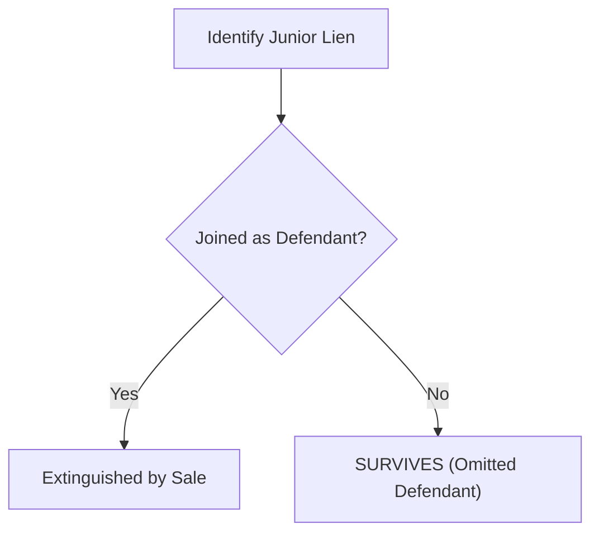
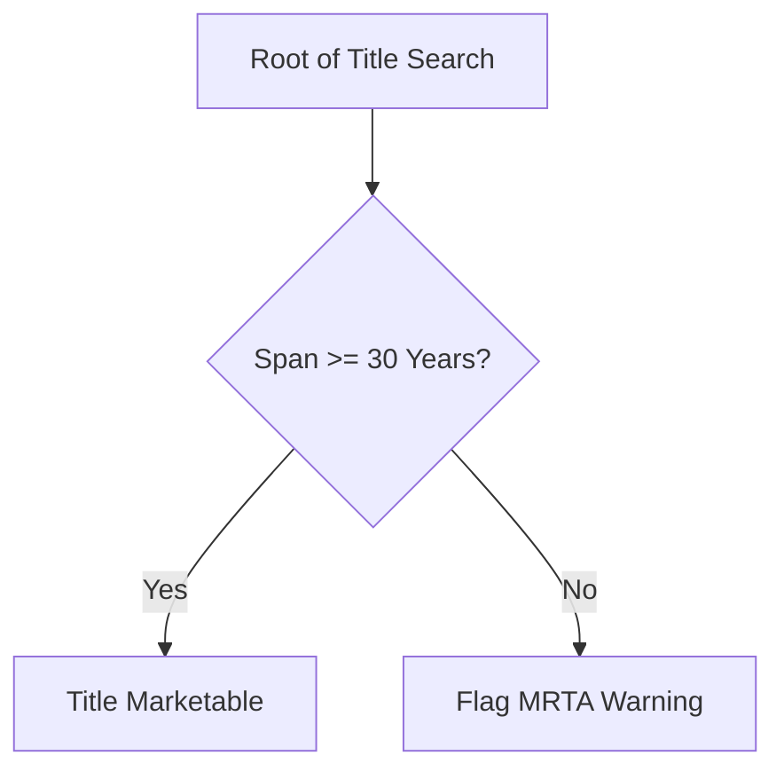
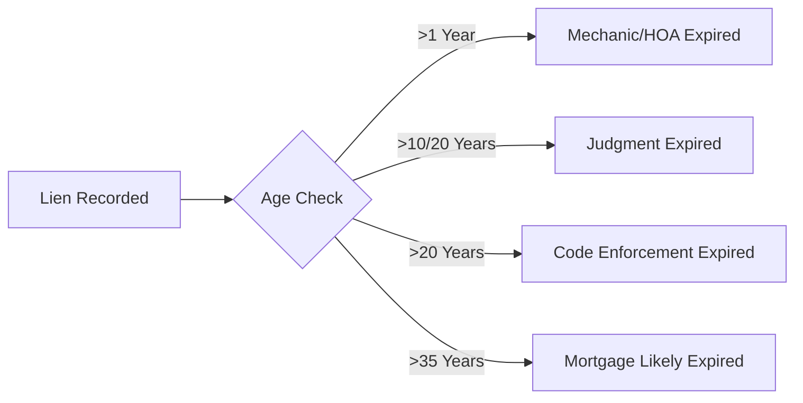
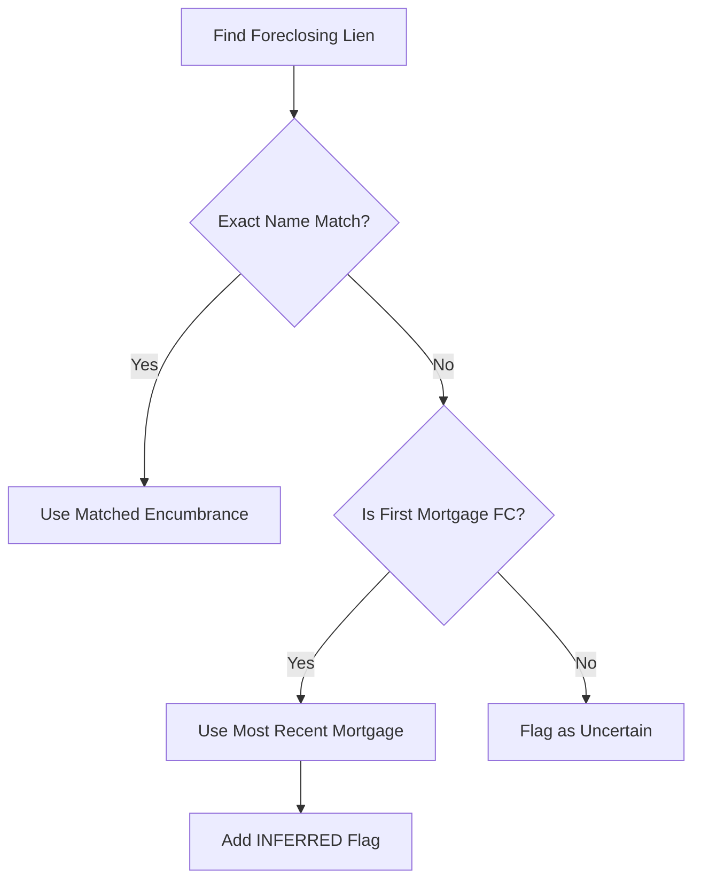

# Pipeline Execution Steps

This document is a consolidated reference composed of the step-by-step pipeline execution guides:
- `00_pipeline_overview.md`
- `01_foreclosure_auctions.md`
- `02_5_resolve_parcel_ids.md`
- `02_final_judgment.md`
- `03_5_homeharvest.md`
- `03_bulk_enrichment.md`
- `04_hcpa_gis.md`
- `06_lien_survival.md`
- `07_sunbiz_lookup.md`
- `08_building_permits.md`
- `09_flood_zone.md`
- `10_market_zillow.md`
- `11_market_realtor.md`
- `13_tax_status.md`

---


## 00_pipeline_overview.md

# Pipeline Overview

## Architecture

HillsInspector runs a single PG-first pipeline:

- Entry point: `Controller.py`
- Orchestrator: `src/services/pg_pipeline_controller.py`
- Database: PostgreSQL (pipeline + analytics)

The controller executes 24 ordered steps across two phases.

Important runtime behavior:

- Bulk ingestion steps run inline by default.
- Market data runs inline by default.
- Background workers are opt-in with:
  - `--background-bulk-steps`
  - `--background-market-data`
- When background mode is enabled, controller summary can return before workers finish.

## Entry Point

```bash
# Full run (Phase A + Phase B)
uv run Controller.py

# Force stale checks off and run all loaders
uv run Controller.py --force-all

# Quick bounded sanity run
uv run Controller.py --auction-limit 5 --judgment-limit 5 --ori-limit 5 --survival-limit 5 --limit 5

# Phase A only
uv run Controller.py --skip-auction-scrape --skip-judgment-extract --skip-identifier-recovery --skip-ori-search --skip-mortgage-extract --skip-survival --skip-encumbrance-audit --skip-encumbrance-recovery --skip-final-refresh --skip-market-data

# Phase B core only
uv run Controller.py --skip-hcpa --skip-clerk-bulk --skip-clerk-criminal --skip-clerk-civil-alpha --skip-nal --skip-flr --skip-sunbiz-entity --skip-county-permits --skip-tampa-permits --skip-single-pin-permits --skip-foreclosure-refresh --skip-trust-accounts --skip-title-chain --skip-title-breaks --skip-market-data
```

## Pipeline Stages

### Phase A: Bulk Refresh

| Step | Name | Service | Primary PG Outputs | Mode |
|------|------|---------|--------------------|------|
| 1 | `hcpa_suite` | `load_hcpa_suite` | `hcpa_bulk_parcels`, `hcpa_allsales` | inline (background optional) |
| 2 | `clerk_bulk` | `PgClerkBulkService` | `clerk_civil_cases`, `clerk_civil_parties`, related clerk tables | inline (background optional) |
| 3 | `clerk_criminal` | `PgClerkCriminalService` | `clerk_criminal_name_index` | inline (background optional) |
| 4 | `clerk_civil_alpha` | `PgClerkCivilAlphaService` | alpha-index rows in `clerk_civil_parties` | inline (background optional) |
| 5 | `dor_nal` | `PgNalService` | `dor_nal_parcels` | inline (background optional) |
| 6 | `sunbiz_flr` | `PgFlrService` | `sunbiz_flr_*` | inline (background optional) |
| 7 | `sunbiz_entity` | `load_sunbiz_entity` | `sunbiz_entity_*` | inline (background optional) |
| 8 | `county_permits` | `CountyPermitService` | `county_permits` | inline (background optional) |
| 9 | `tampa_permits` | `TampaPermitService` | `tampa_accela_records` | inline (background optional) |
| 10 | `single_pin_permits` | `PgPermitSinglePinService` | targeted permit backfills by pin | inline |
| 11 | `foreclosure_refresh` | `PgForeclosureService` | `foreclosures` (hub refresh) | inline |
| 12 | `trust_accounts` | `PgTrustAccountsService` | `TrustAccount`, `TrustAccountSummary` | inline |
| 13 | `title_chain` | `TitleChainController` | `foreclosure_title_events`, `foreclosure_title_chain`, `foreclosure_title_summary` | inline |
| 14 | `title_breaks` | `PgTitleBreakService` | title-break repair actions | inline |

### Phase B: Per-Auction Enrichment

| Step | Name | Service | Primary PG Outputs | Mode |
|------|------|---------|--------------------|------|
| 15 | `auction_scrape` | `PgAuctionService` | refreshed `foreclosures` auction rows | inline |
| 16 | `judgment_extract` | `PgJudgmentService` | `foreclosures.judgment_data`, `step_judgment_extracted` | inline |
| 17 | `identifier_recovery` | `PgForeclosureIdentifierRecoveryService` | `foreclosures.strap`, `foreclosures.folio` repairs | inline |
| 18 | `ori_search` | `PgOriService` | `ori_encumbrances`, `step_ori_searched` | inline |
| 19 | `mortgage_extract` | `PgMortgageExtractionService` | `foreclosures.mortgage_data` enrichment | inline |
| 20 | `survival_analysis` | `PgSurvivalService` | `ori_encumbrances.survival_status`, `step_survival_analyzed` | inline |
| 21 | `encumbrance_audit` | `run_audit` | read-only audit report payload (no writes) | inline |
| 22 | `encumbrance_recovery` | `EncumbranceRecoveryService` | targeted ORI/mortgage/survival backfills | inline |
| 23 | `final_refresh` | `scripts.refresh_foreclosures.refresh` | recomputed foreclosure metrics | inline |
| 24 | `market_data` | `run_market_data_update` (or dispatcher in background mode) | `property_market` (+ post-market refresh) | inline (background optional) |

## Key Data Domains

| Domain | Key Tables |
|--------|------------|
| Foreclosure hub | `foreclosures`, `foreclosures_history`, `foreclosure_events` |
| Title chain | `foreclosure_title_chain`, `foreclosure_title_events`, `foreclosure_title_summary` |
| Encumbrances | `ori_encumbrances` |
| Parcels & sales | `hcpa_bulk_parcels`, `hcpa_allsales` |
| Clerk | `clerk_civil_cases`, `clerk_civil_parties`, `clerk_civil_events` |
| Tax | `dor_nal_parcels` |
| Permits | `county_permits`, `tampa_accela_records` |
| Market | `property_market` |

## Verification

```sql
-- Active foreclosures
SELECT COUNT(*) AS active_foreclosures
FROM foreclosures
WHERE archived_at IS NULL;

-- Judgment extraction coverage
SELECT
  COUNT(*) FILTER (WHERE judgment_data IS NOT NULL) AS with_judgment_data,
  COUNT(*) AS total_active,
  ROUND(
    100.0 * COUNT(*) FILTER (WHERE judgment_data IS NOT NULL) / NULLIF(COUNT(*), 0),
    2
  ) AS pct_with_judgment_data
FROM foreclosures
WHERE archived_at IS NULL;

-- Encumbrance coverage (by active foreclosure with strap)
WITH scope AS (
  SELECT DISTINCT foreclosure_id, strap
  FROM foreclosures
  WHERE archived_at IS NULL
    AND strap IS NOT NULL
    AND judgment_data IS NOT NULL
)
SELECT
  COUNT(DISTINCT s.foreclosure_id) FILTER (WHERE oe.id IS NOT NULL) AS covered,
  COUNT(DISTINCT s.foreclosure_id) AS total
FROM scope s
LEFT JOIN ori_encumbrances oe ON oe.strap = s.strap;

-- Survival coverage
WITH scope AS (
  SELECT DISTINCT foreclosure_id, strap
  FROM foreclosures
  WHERE archived_at IS NULL
    AND strap IS NOT NULL
    AND judgment_data IS NOT NULL
)
SELECT
  COUNT(DISTINCT s.foreclosure_id) FILTER (WHERE oe.survival_status IS NOT NULL) AS covered,
  COUNT(DISTINCT s.foreclosure_id) AS total
FROM scope s
LEFT JOIN ori_encumbrances oe ON oe.strap = s.strap;
```

```bash
# Check worker outputs when background mode is enabled
ls -1t logs/step_workers/*.log | head
ls -1t logs/market_data_worker_*.log | head
```


## 01_foreclosure_auctions.md

# Auction Scraper

## Overview
The `AuctionScraper` scrapes foreclosure auction data from the Hillsborough County RealForeclose website. It collects property details, auction dates, judgment amounts, and downloads Final Judgment PDFs.

## Source
- **URL**: `https://hillsborough.realforeclose.com`
- **Type**: Web Scraping (Playwright)

## Inputs
- **Date Range**: Start and end dates to scrape auctions for.
- **Target Date**: Specific date to scrape.

## Outputs
- **Property Objects**: List of `Property` objects containing:
    - Case Number
    - Parcel ID
    - Address
    - Assessed Value
    - Final Judgment Amount
    - Auction Date
    - Auction Type
- **Files Stored via ScraperStorage**:
    - **Final Judgment PDFs**: Saved to `data/properties/{property_id}/documents/final_judgment_{doc_id}.pdf`
    - **Vision Output**: Extracted data from Final Judgment PDFs saved to `data/properties/{property_id}/vision/final_judgment/{context}.json`
    - **Screenshots**: Error screenshots saved to `logs/` or current directory on failure.

## Key Methods
- `scrape_date(target_date)`: Scrapes all auctions for a specific date.
- `scrape_all(start_date, end_date)`: Scrapes a range of dates.
- `_download_final_judgment(...)`: Downloads the Final Judgment PDF from the Clerk's OnBase system.
- `_process_final_judgment(prop)`: Extracts structured data from the downloaded PDF using `VisionService`.


## 02_5_resolve_parcel_ids.md

# Step 2.5: Resolve Missing Parcel IDs

## Purpose
Resolve missing `auctions.parcel_id` values after judgment extraction so downstream steps (HCPA, ORI, permits, survival) can run. This step uses judgment data and bulk parcel data to map each auction to a valid strap/folio.

## Placement In Pipeline
Runs **after Step 2 (Final Judgment Extraction)** and **before Step 3 (Bulk Enrichment)**.

## Inputs
From SQLite:
1. `auctions` rows with empty `parcel_id` and `extracted_judgment_data` present.
2. `auctions.property_address` for cases without judgment data but with a scraped address.
3. `bulk_parcels` for address lookup and disambiguation.

From judgment extraction (`extracted_judgment_data` JSON):
1. `property_address`
2. `parcel_id` in clerk format, e.g. `A-08-29-19-4NU-B00000-00004.0`
3. `legal_description` and parsed fields (unit, lot, block, subdivision, is_condo)
4. `defendants`

## Resolution Chain (Reliability Order)
1. **Judgment parcel_id to strap conversion** (deterministic)
2. **Exact address match** against `bulk_parcels.property_address` (unique match)
3. **Legal description disambiguation** using `raw_legal1-4`
4. **Defendant name matching** against `bulk_parcels.owner_name`

## Decision Rules
1. **Immediate skips**
   - Skip if `auctions.folio` is `MULTIPLE PARCEL`.
   - Skip if no judgment data and no auction address.
   - Skip if `parcel_id` already present.

2. **Strategy 1: Judgment parcel_id to strap conversion**
   - Convert clerk format to strap format using the known encoding (Range + Township + Section + Subdivision + Block + Lot + Qualifier + Suffix).
   - **Accept only if the converted strap exists in `bulk_parcels.strap`.** If `bulk_parcels` is empty, this strategy will not resolve anything.
   - If not found, try alternate suffix (e.g., `U` for condos).

3. **Strategy 2: Exact address match**
   - Normalize address to the street line only (before the comma), uppercase. If the judgment address lacks a comma and includes city/state, it may not match until standardized.
   - Query `bulk_parcels.property_address` for an exact match.
   - If exactly one match is found, accept it.
   - If more than one match is found, move to Strategy 3.
   - If zero matches, move to Strategy 1 or Strategy 3 depending on available data.

4. **Strategy 3: Legal description disambiguation**
   - Concatenate `raw_legal1`, `raw_legal2`, `raw_legal3`, `raw_legal4` into a single search string per candidate.
   - Try to match judgment fields in this order: unit, lot, block, subdivision.
   - If exactly one candidate has the best score and score is at least 1, accept it.
   - If still ambiguous, move to Strategy 4.
   - If there is no judgment data, Strategy 3 is skipped (no structured fields to use).

5. **Strategy 4: Defendant name matching**
   - Normalize each defendant name: uppercase, strip legal suffixes (LLC, INC, CORP, ET AL, TRUSTEE, AS TRUSTEE, A/K/A).
   - Build a set of significant words (3+ chars, exclude AND, THE, OF, FOR).
   - Match candidates where all significant words appear in `bulk_parcels.owner_name`.
   - Accept only if exactly one candidate matches.
   - If there is no judgment data, Strategy 4 is skipped (no defendants available).

## Updates
When resolved, update `auctions`:
```
UPDATE auctions
SET folio = ?, parcel_id = ?, has_valid_parcel_id = 1, updated_at = CURRENT_TIMESTAMP
WHERE case_number = ?
```

No updates are made to `parcels` in this step. HCPA enrichment will populate `parcels` after the parcel_id is resolved.

## Logging Requirements
Every decision must be logged so a reviewer can follow the exact reasoning.

Example log:
```
[RESOLVE] === 292016CA004539A001HC ===
[RESOLVE] Status: no parcel_id, has_valid_parcel_id=1
[RESOLVE] Data sources: judgment=NO, auction_address="15610 HOWELL PARK LN, TAMPA, FL- 33625"
[RESOLVE] Strategy 1: SKIP — no judgment data available
[RESOLVE] Strategy 2: using auction address
[RESOLVE] Strategy 2: address_exact query="15610 HOWELL PARK LN" -> 1 result
[RESOLVE]   candidate: strap=1827319C3000001000120U, owner="FRANCIS HORNE/TRUSTEE"
[RESOLVE] RESOLVED via address_exact_unique -> strap=1827319C3000001000120U
```

## Known Edge Cases
1. **Multiple units at one address** (condos or multifamily)
   - Address matches are ambiguous without unit or lot/block information.
   - `raw_legal2` often contains unit identifiers, but unit can appear in any `raw_legal1-4` field.

2. **Owner name mismatch**
   - The HCPA owner may be a later buyer, not the judgment defendant.
   - Name matching is treated as the last-resort strategy.

3. **Bulk data not loaded**
   - If `bulk_parcels` is empty, **none** of the strategies can resolve (including strap conversion, which validates against bulk).
   - Address and legal description matching require bulk data.

## Output Metrics
Return a summary with counts:
```
{
  "total_candidates": N,
  "resolved": M,
  "skipped_no_data": X,
  "skipped_multiple_parcel": Y,
  "skipped_ambiguous": Z,
  "by_strategy": {
    "strap_conversion": a,
    "address_exact_unique": b,
    "legal_desc_match": c,
    "name_match": d
  }
}
```

## Notes
- Address match hit rate on the initial sample was 5/6, but this is not guaranteed for condos or multi-family properties.
- The resolution order favors deterministic identifiers over fuzzy matching.


## 02_final_judgment.md

# Step 2: Final Judgment Extraction

## Overview
This step downloads the Final Judgment of Foreclosure PDF and extracts structured data using the `VisionService` (GLM-4.6v-flash). The Final Judgment is the authoritative source for the total debt amount, the foreclosure type, and the list of defendants whose liens will be wiped out.

## Source
- **URL**: `https://publicaccess.hillsclerk.com` (OnBase / PAVDirectSearch + ORI Public Access)
- **Method**: Playwright (Download) + Vision API (Extraction)

## Process Flow

1.  **Discovery (Primary — Instrument Search)**:
    - The Auction Scraper (Step 1) captures the "Case #" link from the auction site.
    - This link points to a PAVDirectSearch URL (CQID 320 - Instrument Search).
    - Example: `https://publicaccess.hillsclerk.com/PAVDirectSearch/index.html?CQID=320&OBKey__1006_1=2025060477`
    - The `instrument_number` is extracted from the URL parameter `OBKey__1006_1`.

2.  **Discovery (Fallback — ORI Case Number Search)**:
    - ~30% of auction listings have **empty instrument numbers** (`OBKey__1006_1=` with no value).
    - In this case, `_search_judgment_by_case_number()` queries the ORI case search API:
      ```
      POST https://publicaccess.hillsclerk.com/Public/ORIUtilities/DocumentSearch/api/Search
      Body: {"CaseNum": "292024CA003499A001HC"}
      ```
    - The API returns all recorded documents for the case (judgments, lis pendens, orders, etc.).
    - We filter for `(JUD) JUDGMENT` in `DocType` to find the Final Judgment.
    - The response includes the document `ID` (for download) and `PartiesOne`/`PartiesTwo` (plaintiff/defendant).
    - **Important**: The browser must first navigate to `publicaccess.hillsclerk.com/oripublicaccess/` before calling the API (same-origin CORS requirement).

3.  **Download**:
    - Using either the intercepted KeywordSearch response (primary) or the ORI search result (fallback), we obtain the internal **Document ID**.
    - The PDF is downloaded via: `.../PAVDirectSearch/api/Document/{encoded_doc_id}/?OverlayMode=View`.
    - The PDF is saved to `data/Foreclosure/{case_number}/documents/final_judgment_{instrument}.pdf`.

4.  **Backfill (Step 2 Pre-pass)**:
    - At the start of Step 2 in the orchestrator, cases without `step_pdf_downloaded` are identified.
    - For each, the ORI case search fallback is attempted to download the missing PDF.
    - This ensures cases scraped before the fallback was implemented still get their PDFs.

5.  **Extraction**:
    - `FinalJudgmentProcessor` renders PDF pages to images via PyMuPDF.
    - Priority pages (first 3 + last 5) are sent first; full document chunked if critical fields are missing.
    - The LLM extracts amounts, parties, dates, and legal descriptions into JSON.

6.  **Thin Extraction Detection**:
    - After extraction, `FinalJudgmentProcessor.is_thin_extraction()` checks for missing `legal_description` AND missing `foreclosed_mortgage` references.
    - If thin: the full PDF text is dumped to `data/Foreclosure/{case_number}/debug/pdf_full_text.txt` for manual review.
    - The case is queued for recovery (see below).
    - If no structured data at all: PDF text is also dumped and the case is marked failed.

7.  **Recovery (CC Cases / Wrong PDFs)**:
    - The auction website sometimes links to the wrong document (e.g. a fee order from a County Court case instead of the real Final Judgment of Foreclosure from the Circuit Court case).
    - **Case number format**: `29YYYYCC...` = County Court (HOA, code enforcement); `29YYYYCA...` = Circuit Court (mortgage foreclosure).
    - Recovery runs as a batch after the main extraction loop, using a single Playwright session.
    - **Recovery strategy** (`AuctionScraper._recover_judgment_via_party_search()`):
      1. Extract party names (plaintiff + defendants) from the thin extraction result.
      2. Search ORI by each party name via `POST /Public/ORIUtilities/DocumentSearch/api/Search` with `{"PartyName": "..."}`.
      3. Find **(LP) LIS PENDENS** documents in results — the LP is filed at the start of the real foreclosure and is recorded under the **CA (Circuit Court) case number**.
      4. Extract the CA case number from the LP record's `CaseNum` field.
      5. Search ORI by that CA case number for **(JUD) JUDGMENT** documents.
      6. Download the real Final Judgment PDF, saved as `final_judgment_recovered_{instrument}.pdf`.
      7. Re-run `FinalJudgmentProcessor.process_pdf()` on the recovered PDF.
    - If recovery succeeds: the real extraction replaces the thin one (tagged with `_recovery` metadata).
    - If recovery fails: the thin result is stored anyway (better than nothing), with the debug text dump available.

## Extracted Data

The following data is extracted and stored in the `auctions` table:

### Financials
- `total_judgment_amount`: The total debt owed to the plaintiff.
- `principal_amount`: The original unpaid principal balance.
- `interest_amount`: Accrued interest.
- `attorney_fees`, `court_costs`: Legal costs added to the judgment.

### Parties
- **Plaintiff**: The foreclosing entity (Bank, HOA, etc.).
- **Defendants**: List of all parties named in the lawsuit. Critical for determining which liens are extinguished.
- **Red Flags**: Detection of Federal Defendants (IRS, USA) which trigger extended redemption periods.

### Property & Procedural
- `foreclosure_type`: "FIRST MORTGAGE", "HOA", "TAX", etc.
- `lis_pendens_date`: The cutoff date for junior liens.
- `sale_date`: Scheduled date of the auction.
- `legal_description`: Verbatim text from the judgment.

## Technical Details

### OnBase Integration
We previously attempted to scrape the HOVER system (`hover.hillsclerk.com`), but it is protected by PerimeterX (returns 403 to headless browsers). The Auction site links directly to OnBase (PAVDirectSearch), bypassing the need for a general case search. We use "Instrument Search" (CQID 320) as the primary path.

When the instrument number is missing, we use the ORI Public Access case search, which is a separate Angular SPA at `/oripublicaccess/`. The underlying API (`/Public/ORIUtilities/DocumentSearch/api/Search`) accepts a JSON body with `CaseNum` and returns a `ResultList` array. Each result has:
- `Instrument` — the ORI instrument number
- `DocType` — e.g. `(JUD) JUDGMENT`, `(LP) LIS PENDENS`, `(ORD) ORDER`
- `ID` — URL-safe document ID for the PAV download API
- `PartiesOne` / `PartiesTwo` — plaintiff and defendant name arrays
- `PageCount`, `RecordDate`, `UUID`

### Coverage
As of 2026-02-08: 180/186 cases (96.8%) have Final Judgment PDFs. The remaining 6 cases have no judgment recorded in the ORI system yet (only Lis Pendens or Orders exist).

### CC vs CA Case Numbers
- **CA** (Circuit Court/Circuit Civil): Mortgage foreclosures. Judgments contain property address, legal description, parcel ID, mortgage instrument details, defendant list, and financial breakdown. These are the high-value cases.
- **CC** (County Court): HOA liens, code enforcement, small claims. The PDF linked on the auction page may be a fee order or other minor document, NOT the real Final Judgment of Foreclosure.
- **Critical insight**: A CC case on the auction site often corresponds to an HOA or code enforcement lien on a property that ALSO has a CA mortgage foreclosure case. The LP (Lis Pendens) filed by the mortgage lender connects the two. Never dismiss CC cases — follow the chain to the real judgment.

### Debug Text Dumps
When extraction fails or yields thin results, the full PyMuPDF text is dumped to:
```
data/Foreclosure/{case_number}/debug/pdf_full_text.txt
```
This allows manual inspection to determine:
- Whether the PDF is actually a Final Judgment or a different document type
- Whether the vision model missed extractable data
- What party names are available for recovery searches

### Vision Prompt
The extraction uses `zai-org/glm-4.6v-flash` (local vLLM endpoint). The prompt is designed to be extremely precise, instructing the model to transcribe legal descriptions verbatim and capture every defendant. Cloud fallbacks (OpenAI gpt-4o, Gemini 2.0 flash) are available if the local endpoint is down.

See `src/services/vision_service.py` for the full prompt text.

## Key Files
- `src/orchestrator.py` — Step 2 main loop, recovery batch, `_store_judgment_result()` helper
- `src/services/final_judgment_processor.py` — PDF rendering, vision extraction, `is_thin_extraction()`, `dump_pdf_text()`
- `src/scrapers/auction_scraper.py` — `_search_judgment_by_case_number()`, `_recover_judgment_via_party_search()`
- `src/services/vision_service.py` — Vision API calls and prompt


## 03_5_homeharvest.md

# Step 3.5: HomeHarvest Enrichment

## Overview
This step enriches properties with MLS data from Realtor.com via the HomeHarvest library. It provides property photos, listing history, and detailed property information that supplements HCPA bulk data.

## Source
- **Library**: [HomeHarvest](https://pypi.org/project/homeharvest/) (Python package)
- **Data Origin**: Realtor.com MLS data
- **Method**: Python API calls with rate limiting

## Process Flow

1. **Property Selection**:
   - Query auctions where `needs_homeharvest_enrichment = TRUE`
   - Require valid `property_address` from parcels table
   - Skip properties with `hcpa_scrape_failed = TRUE`
   - Skip properties with recent HomeHarvest data (< 7 days old)

2. **Address Formatting**:
   - Clean HCPA format addresses (fix "FL- " to "FL ")
   - Construct full address: `{street}, {city}, FL {zip}`
   - Handle incomplete addresses by appending missing components

3. **Data Retrieval**:
   - Call `scrape_property(location=address, listing_type="sold", past_days=3650)`
   - Rate limited: 15-30 second delay between requests
   - Auto-upgrade detection if library is outdated

4. **Storage**:
   - Insert record into `home_harvest` table
   - Mark `needs_homeharvest_enrichment = FALSE` on success

## Data Points

The following fields are captured in the `home_harvest` table:

### Property Photos (Critical for Web UI)
| Field | Type | Description |
|-------|------|-------------|
| `primary_photo` | VARCHAR | Main listing photo URL |
| `photos` | JSON | Array of all photo URLs |
| `alt_photos` | JSON | Alternative photo URLs |

### Listing Information
| Field | Type | Description |
|-------|------|-------------|
| `list_price` | DOUBLE | Current or last list price |
| `sold_price` | DOUBLE | Last sale price |
| `last_sold_date` | TIMESTAMP | Date of last sale |
| `days_on_mls` | INTEGER | Days on market |
| `mls_status` | VARCHAR | Active, Sold, Pending, etc. |
| `hoa_fee` | DOUBLE | Monthly HOA fee |

### Property Details
| Field | Type | Description |
|-------|------|-------------|
| `beds` | DOUBLE | Number of bedrooms |
| `full_baths` | DOUBLE | Full bathrooms |
| `half_baths` | DOUBLE | Half bathrooms |
| `sqft` | DOUBLE | Living area square footage |
| `lot_sqft` | DOUBLE | Lot size in square feet |
| `year_built` | INTEGER | Year constructed |
| `stories` | DOUBLE | Number of stories |
| `garage` | DOUBLE | Garage spaces |

### Location
| Field | Type | Description |
|-------|------|-------------|
| `latitude` | DOUBLE | GPS latitude |
| `longitude` | DOUBLE | GPS longitude |
| `neighborhoods` | VARCHAR | Neighborhood names |
| `nearby_schools` | JSON | School information |

## Pipeline Integration

### Location in Pipeline
```
Step 1   → Foreclosure Auction Scrape
Step 1.5 → Tax Deed Auction Scrape
Step 2   → Final Judgment Extraction
Step 3   → Bulk Data Enrichment
Step 3.5 → HomeHarvest Enrichment  ← THIS STEP
Step 4+  → Parallel Property Enrichment (Orchestrator)
```

### Code Location
- **Service**: `src/services/homeharvest_service.py`
- **Pipeline Call**: `main.py` → `handle_update()` (after Step 3)

### Execution
```python
# In main.py handle_update()
from src.services.homeharvest_service import HomeHarvestService

hh_service = HomeHarvestService()
hh_props = hh_service.get_pending_properties(limit=100, auction_date=start_date)

for prop_data in hh_props:
    success = hh_service._process_single_property(folio, location)
    if success:
        db.mark_step_complete(case_number, "needs_homeharvest_enrichment")
    time.sleep(random.uniform(15.0, 30.0))  # Rate limiting
```

## Rate Limiting

Realtor.com has aggressive bot detection. The service implements:

| Parameter | Value | Purpose |
|-----------|-------|---------|
| `MIN_DELAY` | 15 seconds | Minimum wait between requests |
| `MAX_DELAY` | 30 seconds | Maximum wait (randomized) |
| `parallel` | False | Sequential requests only |

### Auto-Upgrade Feature
If blocked (403, RetryError), the service:
1. Checks for newer HomeHarvest version on PyPI
2. Upgrades via `uv pip install --upgrade homeharvest`
3. Spawns a fresh subprocess with the new version

## Importance

1. **Property Photos**: Critical for web UI - users need to see properties visually
2. **MLS Data**: More accurate/current than HCPA bulk data
3. **HOA Fees**: Important for investment analysis (monthly carrying costs)
4. **Sold History**: Provides comparable sales data

## Web UI Integration

Photos are displayed in the property detail page:
```python
# app/web/database.py
photos = []
primary = homeharvest.get("primary_photo")
if primary:
    photos.append(primary)
for field in ("photos", "alt_photos"):
    extra = _safe_json(homeharvest.get(field))
    if isinstance(extra, list):
        photos.extend(extra)
```

## Troubleshooting

### Common Issues

| Issue | Cause | Solution |
|-------|-------|----------|
| No data returned | Address not found in MLS | Property may be off-market or unlisted |
| Rate limit (403) | Too many requests | Increase delay, check for library update |
| Blocking error | Bot detection | Auto-upgrade triggers, or wait and retry |

### Manual Run
```bash
# Run HomeHarvest for specific properties
uv run python -c "
from src.services.homeharvest_service import HomeHarvestService
hh = HomeHarvestService()
props = hh.get_pending_properties(limit=10)
hh.fetch_and_save(props)
"
```

## Maintenance

- HomeHarvest library updates frequently to combat blocking
- Run `uv add homeharvest --upgrade` periodically
- Check PyPI for new versions if experiencing blocks


## 03_bulk_enrichment.md

# Step 3: Bulk Data Enrichment

## Overview
This step enriches the `parcels` table using the comprehensive bulk data dump from the Hillsborough County Property Appraiser (HCPA). This provides the "source of truth" for ~528,000 parcels, including verified owners, addresses, and assessed values.

## Source
- **Source**: Local DBF/Parquet files
- **Origin**: [HCPA Downloads](https://www.hcpafl.org/Downloads/GIS)
  - `parcel_MM_DD_YYYY.zip` (Main characteristics)
  - `LatLon_Table_MM_DD_YYYY.zip` (Geographic coordinates)
- **Method**: Polars

## Process Flow

1.  **Ingestion**:
    - The `bulk_parcel_ingest.py` script reads the `parcel.dbf` file using `dbfread`.
    - It converts the data to a Polars DataFrame for high-performance processing.
    - The data is saved to a Parquet file (`data/parquet/bulk_parcels_latest.parquet`) for fast future access.
    - The data is bulk-inserted into the `bulk_parcels` table in `data/property_master.db`.

2.  **Enrichment**:
    - The script identifies auctions in the `auctions` table that lack parcel details.
    - It joins `auctions` with `bulk_parcels` on the **STRAP** (State Tax Route Area Parcel) number.
    - It upserts records into the `parcels` table.

## Data Points

The following key fields are populated in the `parcels` table:

- **Identity**: `owner_name`, `property_address`, `city`, `zip_code`
- **Property Details**: `year_built`, `beds`, `baths`, `heated_area`, `lot_size`, `land_use`
- **Value**: `assessed_value`, `market_value`, `just_value`
- **Coordinates**: `latitude`, `longitude` (Sourced from `LatLon_Table`)
- **Legal Description**: `legal_description` (Constructed from `raw_legal1`...`raw_legal4`)

## Importance
This step is critical because:
1.  Auction data often has incomplete or malformatted addresses.
2.  The legal description from bulk data is needed to search for title documents (Step 5).
3.  Assessed value provides a baseline for equity analysis.

## Maintenance
The bulk data file should be refreshed **weekly** (HCPA updates it on Sundays).
Run: `uv run python -m src.ingest.bulk_parcel_ingest --download` to auto-fetch the latest files.

> [!NOTE]
> **Optimization**: By enriching `latitude` and `longitude` here, the pipeline avoids expensive calls to the external geocoding API in Step 15 for the majority of properties.


## 04_hcpa_gis.md

# HCPA GIS Scraper

## Overview
The `hcpa_gis_scraper` scrapes detailed property information from the Hillsborough County Property Appraiser's GIS portal. It is the primary source for sales history, building characteristics, and legal descriptions.

## Source
- **URL**: `https://gis.hcpafl.org/propertysearch/`
- **Type**: Web Scraping (Playwright)

## Inputs
- **Parcel ID**: 19-digit URL-formatted parcel ID (e.g., `1829134XZ000012000090A`).
- **Folio**: Property Folio number (e.g., `1918870000`).

## Outputs
- **Dictionary**: Contains:
    - Sales History (Book/Page, Date, Price, Instrument)
    - Building Info (Year Built, Type)
    - Legal Description
    - Tax Collector Link
    - Permits (Basic info)
- **Files Stored via ScraperStorage**:
    - **Screenshots**: Full page screenshot saved to `data/Foreclosure/{case_number}/screenshots/hcpa_gis/property_details.png`
    - **Raw Data**: Scraped data dictionary saved to `data/Foreclosure/{case_number}/raw/hcpa_gis/property_details.json`
    - **Documents**: Downloaded deeds/instruments from sales history saved to `data/Foreclosure/{case_number}/documents/deed_{doc_id}.pdf`

## Database Writes

### `save_hcpa_to_parcel` (Added 2026-02-09)

After scraping, the orchestrator writes key HCPA data to the `parcels` table via `PropertyDB.save_hcpa_to_parcel()`. This is critical because Phase 2 (ORI ingestion) reads legal descriptions from the `parcels` table to construct search queries.

**Fields written:**
- `property_address` (from `property_info.site_address`)
- `year_built` (from `building_info.year_built`)
- `image_url` (from `image_url`)
- `legal_description` (from `legal_description`)

Uses UPSERT pattern: `INSERT OR IGNORE` + `UPDATE ... SET col = COALESCE(?, col)` to preserve existing non-null values.

### `update_legal_description`

Also uses UPSERT pattern (fixed 2026-02-09 from plain UPDATE that silently affected 0 rows on non-existent parcels).

### Parcel ID Format

The `parcels.folio` column stores the **HCPA-format parcel ID** (e.g., `1929084NUB00000000040A`), matching `auctions.parcel_id`. This is NOT the short folio format (e.g., `000411-0000`). The orchestrator queries `parcels WHERE folio = ?` using the auction's `parcel_id`.

## Key Methods
- `scrape_hcpa_property(parcel_id, folio)`: Main scraping function.
- `fetch_sales_documents(hcpa_result)`: Follows links in sales history to download documents from the Clerk's PAV system.

## Bug History

### Parcels Table Empty (Fixed 2026-02-09)

**Root cause:** `_run_hcpa_gis` in `orchestrator.py` never called `upsert_parcel()` or any method to write HCPA data to the `parcels` table. It only called `update_legal_description()`, which was a plain UPDATE on a row that didn't exist yet (affecting 0 rows silently).

**Impact:** The `parcels` table remained empty (0 rows) across all pipeline runs. This caused Phase 2 (ORI ingestion) to find no legal descriptions, skipping chain-of-title analysis for every property. This was the root cause of zero chain-of-title data.

**Fix:**
1. Added `save_hcpa_to_parcel()` method to `PropertyDB`
2. Added call to it in `_run_hcpa_gis` (orchestrator)
3. Changed `update_legal_description()` from plain UPDATE to UPSERT
4. Backfilled 120 parcels from 339 existing HCPA JSON files on disk


## 06_lien_survival.md

# Lien Research Documentation

## Overview
This document outlines the process and resources for researching liens, mortgages, deeds, and other property records for foreclosure analysis in Hillsborough County, Florida.

---

## Data Sources

### 1. Official Records Index (ORI) - PRIMARY SOURCE FOR PROPERTY RECORDS
**Website:** https://publicaccess.hillsclerk.com/oripublicaccess/

**Purpose:** Search for property-related documents including:
- Mortgages (first, second, etc.)
- Deeds (Warranty Deed, Quit Claim, etc.)
- Liens (tax liens, mechanic's liens, judgment liens)
- Assignments (Critical for tracking current creditor)
- Releases/Satisfactions
- Lis Pendens
- Notices of Commencement

**Key Information:**
- Priority is determined by the **Recording Date** (Race-Notice Statute, Fla. Stat. Chapter 695).
- Contains ALL recorded documents affecting property ownership.
- Searchable back to historical records.
- Critical for determining lien priority and ownership chain.

---

### 2. HOVER (Court Case Documents) - SECONDARY SOURCE
**Website:** https://hover.hillsclerk.com

**Purpose:** Search for court case documents including:
- Final Judgments
- Lis Pendens (court filing)
- Court orders
- **Defendant List** (Critical for checking if junior lienholders were joined)

---

## Lien Research Workflow

### Step 1: Identify the Property
- **Input:** Parcel ID (Folio) from foreclosure case.

### Step 2: Search Official Records Index
1. Search by Parcel ID (Folio).
2. Filter by Document Type:
   - **Mortgages**: Look for all mortgages. Note the **Recording Date** as the primary rank.
   - **Liens**: Tax liens, judgment liens, HOA liens, mechanic's liens.
   - **Assignments**: Track many-to-one or one-to-many servicer changes (e.g., Chase -> Nationstar).
   - **Lis Pendens**: Find the specific LP for the foreclosure case.
3. Record each document:
   - Document Type, Recording Date, Book/Page, Amount, Creditor/Debtor.

### Step 3: Determine Lis Pendens & Priority
- **Critical:** The Lis Pendens (LP) date of the foreclosing case determines which liens are senior or junior.
- **Mortgage Priority**: Ranked by the order in which they were filed with the county.
- **Senior Liens**: Recorded BEFORE the foreclosing mortgage. They survive.
- **Junior Liens**: Recorded AFTER the foreclosing mortgage. They are wiped out **IF properly joined**.

---

## Florida Lien Survival Logic (Implementation)

### Core Principle: Senior vs Junior & Joinder
When a **senior lien** (e.g. 1st mortgage) forecloses, all **properly joined junior liens** are extinguished.

#### Joined vs. Omitted Defendants
If a junior lienholder is **NOT named as a defendant** in the foreclosure suit, their lien **SURVIVES** the foreclosure.
- **Joined**: Extinguished by the sale (Certificate of Title).
- **Omitted**: Survives; the buyer takes title subject to the omitted lien. A "reforeclosure" action may be required to clear it.



### What ALWAYS Survives Foreclosure (Superpriority)
These liens have **superpriority** and survive regardless of who forecloses:

| Lien Type | Statute | Notes |
|-----------|---------|-------|
| **Property Tax Liens** | Fla. Stat. 197 | County/City taxes always survive. |
| **PACE Liens** | Fla. Stat. 163.08 | Property Assessed Clean Energy liens have equal dignity to taxes. |
| **Municipal Utility Liens** | Fla. Stat. 153.67 / 159.17 | Water/sewer liens have statutory superpriority. |
| **Federal IRS/DOJ Liens** | Federal Law | **Wiped as a lien if joined, BUT subject to a 120-day Redemption Right.** |

> [!IMPORTANT]
> **IRS Redemption Right**: The federal government has 120 days from the date of the foreclosure sale to "redeem" the property by paying the purchase price (plus interest). This effectively wipes out the auction buyer's profit.

### What Gets Wiped Out
When a **first mortgage** forecloses, these are typically extinguished (if joined):
- **Second Mortgages**: Junior to first.
- **HELOC**: Usually junior.
- **Judgment Liens**: If recorded after the mortgage.
- **HOA/COA Liens**: Subject to "Safe Harbor" limits (12 months or 1% of debt).

### Marketable Record Title Act (MRTA)
Florida's MRTA (Fla. Stat. Chapter 712) aims to clear old "clouds" on title.
- **30-Year Rule**: A title search spanning at least 30 back to a "root of title" is necessary to confirm no ancient claims or easements persist.
- **Implementation**: The pipeline checks the length of the chain of title and flags if it's less than 30 years.



### Assignment Tracking
Mortgages are frequently assigned (e.g., Bank of America -> Nationstar -> Mr. Cooper).
- **Code Logic**: The system tracks the `current_creditor` through these assignments.
- **Why?**: Satisfactions often name the *current* servicer, not the *original* lender. Without tracking, the satisfaction would fail to match the mortgage.

```mermaid
graph LR
    A[Original Lender] --> B[Assignee 1] --> C[Assignee 2 (Current)]
    D[Satisfaction from Assignee 2] --- C
```

---

## Technical Implementation (LienSurvivalAnalyzer)

### Survival Decision Tree
```mermaid
graph TD
    A[Identify Target Lien] --> B{Is Superpriority?}
    B -- Yes (PACE/Tax/Utility) --> C[SURVIVES]
    B -- No --> D{Is Federal IRS/DOJ?}
    D -- Yes --> E[EXTINGUISHED with 120-day Redemption]
    D -- No --> F{Recorded before foreclosure LP?}
    F -- Yes --> G[SURVIVES (Senior)]
    F -- No --> H{Joined as Defendant?}
    H -- Yes --> I[EXTINGUISHED (Junior)]
    H -- No --> J[SURVIVES (Omitted)]
```

### Expiration Logic (SOL)
The system also checks if liens have expired by law:
- **Mechanic's Liens**: 1 year (Fla. Stat. 713.22)
- **HOA Cloud of Lien**: 1 year (Fla. Stat. 720.3085)
- **Judgment Liens**: 10-20 years (Fla. Stat. 55.10)
- **Code Enforcement**: 20 years (Fla. Stat. 162.09)



---

## Foreclosing Lien Identification

### Challenge: Securitized Mortgages
When mortgages are securitized (sold to trusts), the plaintiff name often differs from the recorded creditor:
- **Recorded Creditor**: Original lender or MERS nominee (e.g., "KIAVI FUNDING INC")
- **Plaintiff**: Trustee of securitization trust (e.g., "U.S. BANK NATIONAL ASSOCIATION, AS TRUSTEE FOR LHOME MORTGAGE TRUST 2024-RTL3")

Assignments to trusts are often not recorded in public records, breaking the name-matching logic.

### Solution: Inference Fallback
When exact name matching fails:
1. Check if `foreclosure_type` contains "FIRST" or "MORTGAGE"
2. Find the most recent unsatisfied mortgage for the current owner
3. Infer this as the foreclosing lien
4. Flag with `FORECLOSING_LIEN_INFERRED` uncertainty



---

## Scraper Implementation Status

### ✅ Working:
- **ORI Scraper**: Ingests mortgages, liens, and assignments.
- **Title Chain Service**: Builds timeline, tracks assignments, calculates MRTA.
- **Survival Analyzer**: Orchestrates the logic defined above.
- **Foreclosing Lien Inference**: Falls back to most recent mortgage when name matching fails (Dec 2025).

### ⚠️ Removed:
- **Tax Deed Sales**: This logic has been moved to a separate document: [TaxDeed.md](file:///home/user/code/HillsInspector/docs/TaxDeed.md).


## 07_sunbiz_lookup.md

# Sunbiz Scraper

## Overview
The `SunbizScraper` searches the Florida Division of Corporations (Sunbiz) to identify business entities associated with property owners.

## Source
- **URL**: `https://search.sunbiz.org`
- **Type**: Web Scraping (Playwright)

## Inputs
- **Entity Name**: Business name to search.
- **Officer Name**: Name of officer/registered agent (property owner).
- **Document Number**: Specific entity ID.

## Outputs
- **BusinessEntity Objects**: List containing:
    - Name, Document Number, Status
    - Filing Date, State, Addresses
    - Officers/Registered Agents
- **Files Stored via ScraperStorage**:
    - **Raw Data**: Search results saved to `data/properties/{property_id}/raw/sunbiz/officer_search.json`

## Key Methods
- `search_entity(name)`: Search by business name.
- `search_by_officer(name)`: Search by officer name (useful for finding LLCs owned by a person).
- `search_for_property(...)`: Wrapper for property owner search with caching via `ScraperStorage`.


## 08_building_permits.md

# Permit Scraper

## Overview
The `PermitScraper` collects building permit information from the Accela Citizen Access portals for both the City of Tampa and Hillsborough County.

## Source
- **City of Tampa URL**: `https://aca-prod.accela.com/TAMPA/Default.aspx`
- **Hillsborough County URL**: `https://aca-prod.accela.com/HCFL/Default.aspx`
- **Type**: Web Scraping (Playwright) + Vision API

## Inputs
- **Address**: Street address, city.
- **Property ID**: For storage.

## Outputs
- **Permit List**: List of `PermitDetail` objects (Number, Type, Status, Date, Description).
- **Files Stored via ScraperStorage**:
    - **Screenshots**: Search result screenshots saved to `data/properties/{property_id}/screenshots/permits/permit_{source}_{timestamp}.png`
    - **Vision Output**: Extracted permit data saved to `data/properties/{property_id}/vision/permits/{context}.json`
    - **Raw Data**: Scraped data recorded in database via `record_scrape`.

## Key Methods
- `get_permits(address, city)`: Queries both City and County portals based on location.
- `get_permits_for_property(...)`: Wrapper with caching support via `ScraperStorage`.


## 09_flood_zone.md

# FEMA Flood Scraper

## Overview
The `FEMAFloodChecker` queries the FEMA National Flood Hazard Layer (NFHL) ArcGIS API to determine the flood zone for a given property.

## Source
- **URL**: `https://hazards.fema.gov/arcgis/rest/services/public/NFHL/MapServer`
- **Type**: API (ArcGIS REST)

## Inputs
- **Coordinates**: Latitude and Longitude of the property.
- **Property ID**: For caching purposes.

## Outputs
- **FloodZoneResult**: Object containing:
    - Flood Zone (e.g., AE, X, VE)
    - Risk Level (High, Moderate, Minimal)
    - Base Flood Elevation (BFE)
    - Insurance Requirement status
- **Files Stored via ScraperStorage**:
    - **Raw Data**: JSON response from FEMA API saved to `data/properties/{property_id}/raw/fema/flood_zone.json`

## Key Methods
- `get_flood_zone(lat, lon)`: Queries the API for a specific coordinate.
- `get_flood_zone_for_property(property_id, lat, lon)`: Wrapper with caching support via `ScraperStorage`.


## 10_market_zillow.md

# Market Scraper

## Overview
The `MarketScraper` gathers market data (estimates, status, photos) from Zillow and Realtor.com. It relies heavily on `VisionService` and `playwright-stealth` to bypass bot detection.

## Source
- **URLs**: 
    - `https://www.zillow.com`
    - `https://www.realtor.com`
- **Type**: Web Scraping (Playwright Stealth) + Vision API

## Inputs
- **Address**: Street address, city, state, zip code.
- **Property ID**: For storage.

## Outputs
- **ListingDetails**: Object containing:
    - Price / Estimates (Zestimate, Rent Zestimate)
    - Status (For Sale, Sold, Off Market)
    - Description
- **Files Stored via ScraperStorage**:
    - **Screenshots**: Listing page screenshots saved to `data/properties/{property_id}/screenshots/market_zillow/listing.png`
    - **CAPTCHA Screenshots**: Saved if CAPTCHA is encountered.
    - **Vision Output**: Extracted data saved to `data/properties/{property_id}/vision/market_zillow/listing.json`

## Key Methods
- `get_listing_details(...)`: Navigates to the listing page, handles CAPTCHAs (via Vision), takes a screenshot, and extracts data.
- `get_listing_with_captcha_handling(...)`: Wrapper with explicit CAPTCHA solving logic.


## 11_market_realtor.md

# Step 11: Realtor.com Market Data

## Overview
The `RealtorScraper` gathers detailed property data from Realtor.com, supplementing Zillow data with better HOA info, price history, and descriptions. It uses `VisionService` and `playwright-stealth`.

## Source
- **URL**: `https://www.realtor.com`
- **Type**: Web Scraping (Playwright Stealth) + Vision API
- **Scraper**: `src/scrapers/realtor_scraper.py`

## Why Both Zillow AND Realtor?

| Data Point | Zillow | Realtor.com |
|------------|--------|-------------|
| Zestimate | Best | N/A |
| HOA Fees | Often missing | More accurate |
| Price History | Basic | Detailed |
| Agent Remarks | Limited | Full description |
| Listing Status | Good | Good (redundant verification) |

## Inputs
- **Address**: Street address, city, state, zip code.
- **Property ID**: For storage and caching.

## Outputs
- **RealtorListing**: Object containing:
    - Price / Status
    - HOA Fees & Frequency
    - Price History
    - Property Details (Beds, Baths, Sqft, Year Built)
- **Files Stored via ScraperStorage**:
    - **Screenshots**: Full page screenshots saved to `data/properties/{property_id}/screenshots/realtor/realtor_{address}_{timestamp}.png`
    - **Vision Output**: Extracted data saved to `data/properties/{property_id}/vision/realtor/{context}.json`

## Orchestrator Integration

### Phase 1: Parallel Scraping
Realtor.com scraping runs in Phase 1 alongside other scrapers:

```python
# In orchestrator.py
async with asyncio.TaskGroup() as tg:
    tg.create_task(self._run_tax_scraper(parcel_id, address))
    tg.create_task(self._run_market_scraper(parcel_id, address))      # Zillow
    tg.create_task(self._run_realtor_scraper(parcel_id, address))     # Realtor.com
    tg.create_task(self._run_fema_checker(parcel_id, address))
    tg.create_task(self._run_sunbiz_scraper(parcel_id, prop.owner_name))
    tg.create_task(self._run_hcpa_gis(parcel_id))
```

### Concurrency Control
```python
# Low concurrency due to aggressive rate limiting
self.realtor_semaphore = asyncio.Semaphore(2)
```

### Skip Logic
```python
async def _run_realtor_scraper(self, parcel_id: str, address: str):
    # Skip if already have Realtor data
    if self.db.folio_has_realtor_data(parcel_id):
        return
```

### Data Saved to market_data Table
```python
await self.db_writer.enqueue("save_market_data", {
    "folio": parcel_id,
    "source": "Realtor",  # Distinguishes from "Zillow"
    "data": {
        "list_price": listing.list_price,
        "listing_status": listing.listing_status,
        "hoa_fee": listing.hoa_fee,
        "hoa_frequency": listing.hoa_frequency,
        "days_on_market": listing.days_on_market,
        "price_per_sqft": listing.price_per_sqft,
        "beds": listing.beds,
        "baths": listing.baths,
        "sqft": listing.sqft,
        "year_built": listing.year_built,
        "description": listing.description,
        "realtor_url": listing.realtor_url,
    },
    "screenshot_path": listing.screenshot_path
})
```

## Key Methods
- `get_listing_details(...)`: Navigates to the listing page, simulates human behavior, takes screenshots, and extracts data.
- `get_listing_for_property(...)`: Wrapper with caching support via `ScraperStorage`.

## Anti-Bot Measures

Realtor.com uses aggressive bot detection (PerimeterX/Datadome). The scraper implements:

1. **Playwright Stealth**: Hides automation fingerprints
2. **Human-like Behavior**:
   - Random scrolling (2-4 scrolls, 200-500px each)
   - Random mouse movements (3-6 movements)
   - Random delays (0.5-2.0 seconds)
3. **Realistic Browser Context**:
   - Chrome user agent
   - 1920x1080 viewport
   - US timezone and locale

### Blocking Detection
```python
is_blocked = (
    "captcha" in content.lower() or
    "blocked" in content.lower() or
    "request could not be processed" in page_text.lower() or
    "reference id is" in page_text.lower() or
    "unblockrequest@realtor.com" in page_text.lower()
)

if is_blocked:
    logger.warning("Realtor.com blocked the request")
    # Screenshot saved for debugging
    return listing  # Return empty listing
```

## Database Query
Check for existing Realtor data:
```sql
SELECT COUNT(*) FROM market_data
WHERE folio = ? AND source = 'Realtor'
```

## Troubleshooting

| Issue | Cause | Solution |
|-------|-------|----------|
| Blocked/403 | Bot detection | Wait, reduce concurrency |
| No data | Property not on Realtor.com | Normal - not all properties listed |
| Missing HOA | Not disclosed | Check HOA separately |

## Code Location
- **Scraper**: `src/scrapers/realtor_scraper.py`
- **Orchestrator Call**: `src/orchestrator.py` → `_run_realtor_scraper()`


## 13_tax_status.md

# Tax Scraper

## Overview
The `TaxScraper` searches the Hillsborough County Tax Collector's website for unpaid property taxes and liens.

## Source
- **URL**: `https://hillsborough.county-taxes.com/public`
- **Type**: Web Scraping (Playwright)

## Inputs
- **Parcel ID**: Property Parcel ID / Folio.

## Outputs
- **Lien Objects**: List of `Lien` objects representing unpaid taxes.
- **Files Stored via ScraperStorage**:
    - **Screenshots**: Search result screenshots saved to `data/properties/{property_id}/screenshots/tax_collector/search_results.png`

## Key Methods
- `get_tax_liens(parcel_id)`: Searches for tax records and identifies outstanding amounts.
