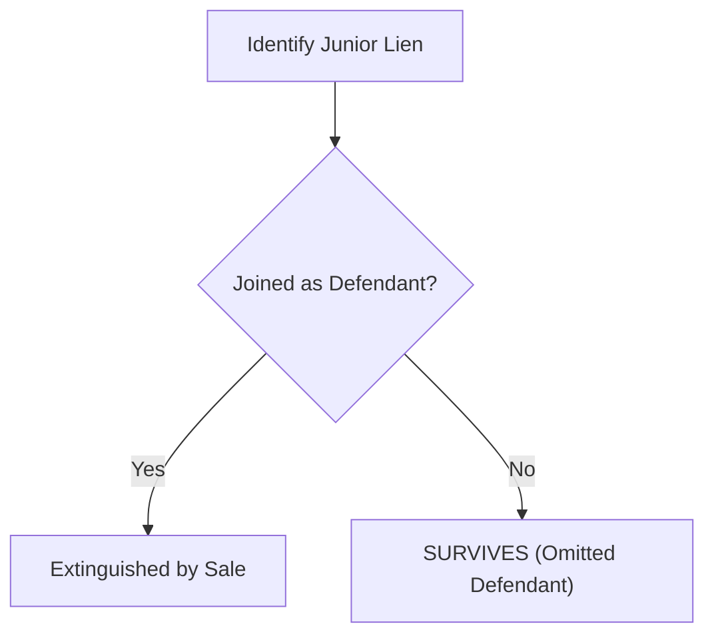
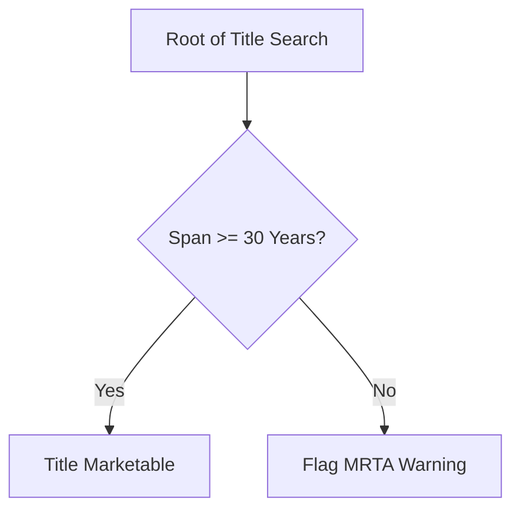
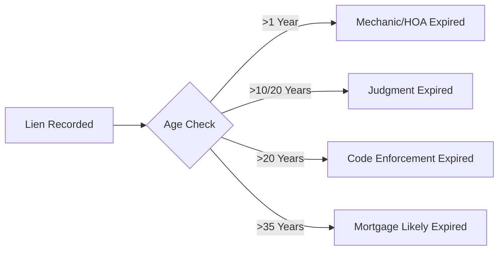

# Lien Research Documentation

## Overview
This document outlines the process and resources for researching liens, mortgages, deeds, and other property records for foreclosure analysis in Hillsborough County, Florida.

---

## Data Sources

### 1. Official Records Index (ORI) - PRIMARY SOURCE FOR PROPERTY RECORDS
**Website:** https://publicaccess.hillsclerk.com/oripublicaccess/

**Purpose:** Search for property-related documents including:
- Mortgages (first, second, etc.)
- Deeds (Warranty Deed, Quit Claim, etc.)
- Liens (tax liens, mechanic's liens, judgment liens)
- Assignments (Critical for tracking current creditor)
- Releases/Satisfactions
- Lis Pendens
- Notices of Commencement

**Key Information:**
- Priority is determined by the **Recording Date** (Race-Notice Statute, Fla. Stat. Chapter 695).
- Contains ALL recorded documents affecting property ownership.
- Searchable back to historical records.
- Critical for determining lien priority and ownership chain.

---

### 2. HOVER (Court Case Documents) - SECONDARY SOURCE
**Website:** https://hover.hillsclerk.com

**Purpose:** Search for court case documents including:
- Final Judgments
- Lis Pendens (court filing)
- Court orders
- **Defendant List** (Critical for checking if junior lienholders were joined)

---

## Lien Research Workflow

### Step 1: Identify the Property
- **Input:** Parcel ID (Folio) from foreclosure case.

### Step 2: Search Official Records Index
1. Search by Parcel ID (Folio).
2. Filter by Document Type:
   - **Mortgages**: Look for all mortgages. Note the **Recording Date** as the primary rank.
   - **Liens**: Tax liens, judgment liens, HOA liens, mechanic's liens.
   - **Assignments**: Track many-to-one or one-to-many servicer changes (e.g., Chase -> Nationstar).
   - **Lis Pendens**: Find the specific LP for the foreclosure case.
3. Record each document:
   - Document Type, Recording Date, Book/Page, Amount, Creditor/Debtor.

### Step 3: Determine Lis Pendens & Priority
- **Critical:** The Lis Pendens (LP) date of the foreclosing case determines which liens are senior or junior.
- **Mortgage Priority**: Ranked by the order in which they were filed with the county.
- **Senior Liens**: Recorded BEFORE the foreclosing mortgage. They survive.
- **Junior Liens**: Recorded AFTER the foreclosing mortgage. They are wiped out **IF properly joined**.

---

## Florida Lien Survival Logic (Implementation)

### Core Principle: Senior vs Junior & Joinder
When a **senior lien** (e.g. 1st mortgage) forecloses, all **properly joined junior liens** are extinguished.

#### Joined vs. Omitted Defendants
If a junior lienholder is **NOT named as a defendant** in the foreclosure suit, their lien **SURVIVES** the foreclosure.
- **Joined**: Extinguished by the sale (Certificate of Title).
- **Omitted**: Survives; the buyer takes title subject to the omitted lien. A "reforeclosure" action may be required to clear it.



### What ALWAYS Survives Foreclosure (Superpriority)
These liens have **superpriority** and survive regardless of who forecloses:

| Lien Type | Statute | Notes |
|-----------|---------|-------|
| **Property Tax Liens** | Fla. Stat. 197 | County/City taxes always survive. |
| **PACE Liens** | Fla. Stat. 163.08 | Property Assessed Clean Energy liens have equal dignity to taxes. |
| **Municipal Utility Liens** | Fla. Stat. 153.67 / 159.17 | Water/sewer liens have statutory superpriority. |
| **Federal IRS/DOJ Liens** | Federal Law | **Wiped as a lien if joined, BUT subject to a 120-day Redemption Right.** |

> [!IMPORTANT]
> **IRS Redemption Right**: The federal government has 120 days from the date of the foreclosure sale to "redeem" the property by paying the purchase price (plus interest). This effectively wipes out the auction buyer's profit.

### What Gets Wiped Out
When a **first mortgage** forecloses, these are typically extinguished (if joined):
- **Second Mortgages**: Junior to first.
- **HELOC**: Usually junior.
- **Judgment Liens**: If recorded after the mortgage.
- **HOA/COA Liens**: Subject to "Safe Harbor" limits (12 months or 1% of debt).

### Marketable Record Title Act (MRTA)
Florida's MRTA (Fla. Stat. Chapter 712) aims to clear old "clouds" on title.
- **30-Year Rule**: A title search spanning at least 30 back to a "root of title" is necessary to confirm no ancient claims or easements persist.
- **Implementation**: The pipeline checks the length of the chain of title and flags if it's less than 30 years.



### Assignment Tracking
Mortgages are frequently assigned (e.g., Bank of America -> Nationstar -> Mr. Cooper).
- **Code Logic**: The system tracks the `current_creditor` through these assignments.
- **Why?**: Satisfactions often name the *current* servicer, not the *original* lender. Without tracking, the satisfaction would fail to match the mortgage.

```mermaid
graph LR
    A[Original Lender] --> B[Assignee 1] --> C[Assignee 2 (Current)]
    D[Satisfaction from Assignee 2] --- C
```

---

## Technical Implementation (LienSurvivalAnalyzer)

### Survival Decision Tree
```mermaid
graph TD
    A[Identify Target Lien] --> B{Is Superpriority?}
    B -- Yes (PACE/Tax/Utility) --> C[SURVIVES]
    B -- No --> D{Is Federal IRS/DOJ?}
    D -- Yes --> E[EXTINGUISHED with 120-day Redemption]
    D -- No --> F{Recorded before foreclosure LP?}
    F -- Yes --> G[SURVIVES (Senior)]
    F -- No --> H{Joined as Defendant?}
    H -- Yes --> I[EXTINGUISHED (Junior)]
    H -- No --> J[SURVIVES (Omitted)]
```

### Expiration Logic (SOL)
The system also checks if liens have expired by law:
- **Mechanic's Liens**: 1 year (Fla. Stat. 713.22)
- **HOA Cloud of Lien**: 1 year (Fla. Stat. 720.3085)
- **Judgment Liens**: 10-20 years (Fla. Stat. 55.10)
- **Code Enforcement**: 20 years (Fla. Stat. 162.09)



---

## Scraper Implementation Status

### ✅ Working:
- **ORI Scraper**: Ingests mortgages, liens, and assignments.
- **Title Chain Service**: Builds timeline, tracks assignments, calculates MRTA.
- **Survival Analyzer**: Orchestrates the logic defined above.

### ⚠️ Removed:
- **Tax Deed Sales**: This logic has been moved to a separate document: [TaxDeed.md](file:///home/user/code/HillsInspector/docs/TaxDeed.md).
